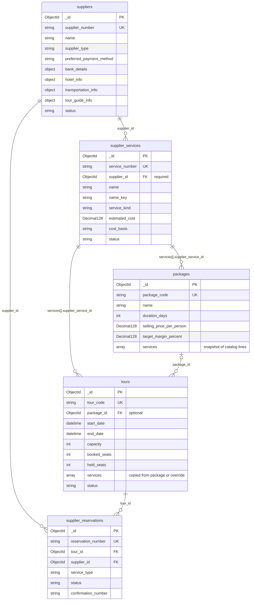
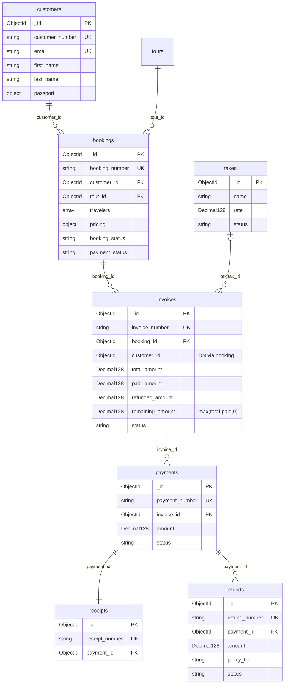
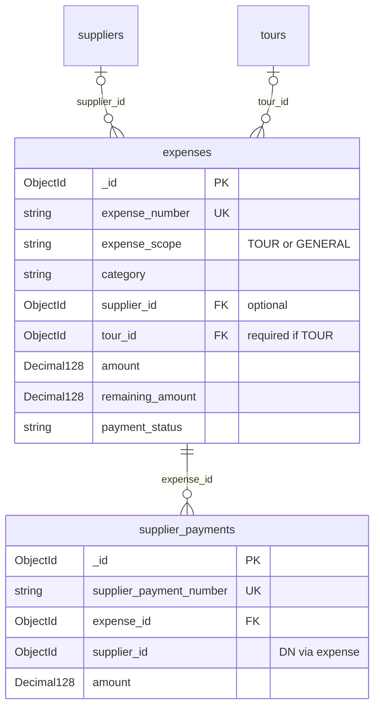

# TourOps ERD

Open this file and turn on **Markdown preview** (`Ctrl+Shift+V`).

Catalog spine: **supplier → supplier_services → package / tour snapshot**. A service cannot exist without a supplier.

Finance / reports are **not collections**. Profit is invoice revenue (`total − refunded`) minus expense documents. AR remaining is `max(total − paid, 0)` — refunds do not reopen the receivable.
